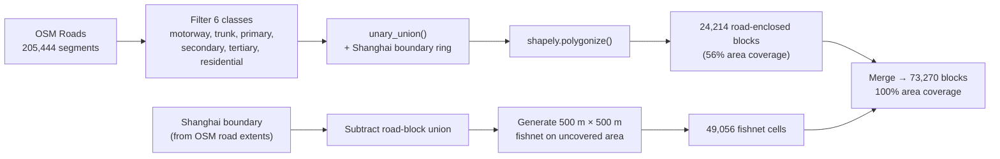
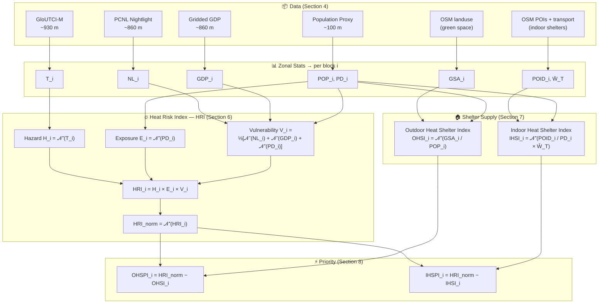
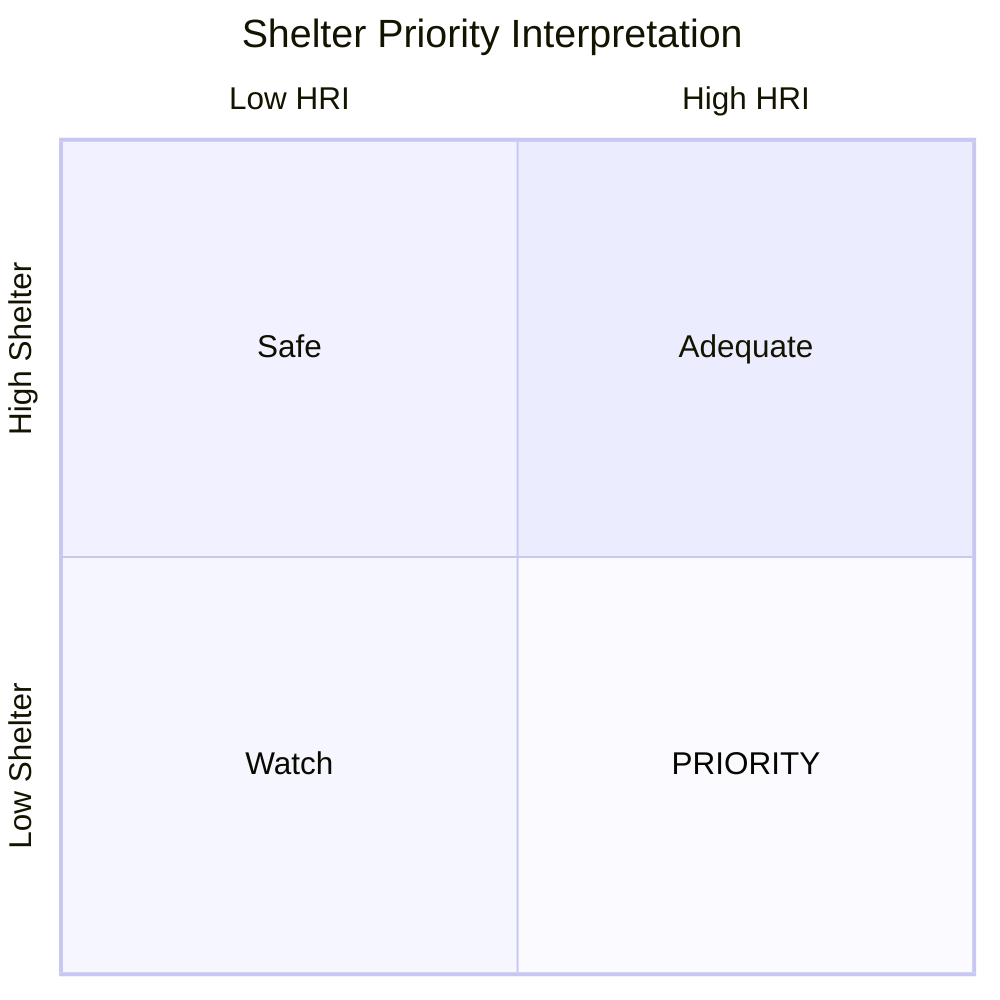

# Heat Risk Index and Shelter Priority Model — Technical Specification

> Shanghai Block-Level Extreme Heat Risk Assessment and Shelter Supply-Demand Matching
>
> Reference implementation: Yang, A. (2025). *Mapping priority zones for urban heat mitigation in Shanghai: Heat risk vs. shelter provision.* Computers, Environment and Urban Systems, 117, 102283. [doi:10.1016/j.compenvurbsys.2025.102283](https://www.sciencedirect.com/science/article/abs/pii/S0198971525000833)

---

## 1. Problem Statement

Extreme heat events in Shanghai (24.9 M residents, subtropical monsoon climate) are intensifying under climate change and rapid urbanisation. Conventional heat-risk maps based on Land Surface Temperature (LST) fail on two counts:

1. **LST ≠ human thermal stress.** Rooftop radiative temperature diverges from pedestrian-level physiological heat load.
2. **Risk maps without resource context are not actionable.** Knowing *where it is hot* is insufficient — planners need to know *where it is hot AND cooling resources are missing*.

This model addresses both gaps by computing a multiplicative Heat Risk Index ($\text{HRI}$) from human-biometeorology data, then subtracting spatially explicit shelter supply indices to identify **intervention priority zones**.

---

## 2. Notation

| Symbol | Definition | Unit |
|--------|-----------|------|
| $H_i$ | Heat Hazard index for block $i$ | dimensionless [0.1, 0.9] |
| $E_i$ | Heat Exposure index for block $i$ | dimensionless [0.1, 0.9] |
| $V_i$ | Heat Vulnerability index for block $i$ | dimensionless [0.1, 0.9] |
| $\text{HRI}_i$ | Heat Risk Index for block $i$ | dimensionless |
| $T_i$ | UTCI mean value for block $i$ | °C |
| $PD_i$ | Population density for block $i$ | persons/km² |
| $POP_i$ | Total population within block $i$ | persons |
| $NL_i$ | Nighttime light intensity for block $i$ | DN |
| $GDP_i$ | Gridded GDP for block $i$ | USD PPP |
| $GSA_i$ | Green space area within block $i$ | m² |
| $POID_i$ | Weighted POI density for block $i$ | weighted count/km² |
| $W_T^{(k)}$ | Operating-time weight for shelter type $k$ | dimensionless [0, 1] |
| $\text{OHSI}_i$ | Outdoor Heat Shelter Index for block $i$ | dimensionless [0.1, 0.9] |
| $\text{IHSI}_i$ | Indoor Heat Shelter Index for block $i$ | dimensionless [0.1, 0.9] |
| $\text{OHSPI}_i$ | Outdoor Heat Shelter Priority Index for block $i$ | dimensionless |
| $\text{IHSPI}_i$ | Indoor Heat Shelter Priority Index for block $i$ | dimensionless |
| $\mathcal{N}^{+}(\cdot)$ | Positive normalisation (higher → higher) | — |
| $\mathcal{N}^{-}(\cdot)$ | Negative normalisation (higher → lower) | — |

---

## 3. Assumptions and Justifications

**A1.** Heat risk is a **multiplicative** interaction: $\text{HRI} = H \times E \times V$. A block with zero population has near-zero $\text{HRI}$ regardless of thermal intensity.
- An additive model ($H + E + V$) would assign moderate risk to uninhabited blocks with extreme UTCI — epidemiologically meaningless, since heat mortality requires people. The multiplicative form ensures risk is only high when all three dimensions co-occur (IPCC AR6; Yang, 2025).

**A2.** UTCI adequately represents pedestrian-level thermal stress. Monthly-mean GloUTCI-M (August 2022) serves as the static Hazard ($H$) proxy.
- UTCI integrates air temperature, humidity, wind speed, and mean radiant temperature via a multi-node thermoregulation model. LST only measures rooftop radiative temperature, diverging from street-level thermal load by up to 10–15°C in urban canyons. August is Shanghai's peak heat month (climatological $T_{\max}$ > 35°C).

**A3.** OSM building footprint area is proportional to residential population. Total footprint is scaled to 24.9 M to derive Population Density ($PD_i$) for Exposure ($E$).
- Building footprint correlates with floor area and occupancy — a standard proxy when census-calibrated gridded data (e.g., WorldPop 5.4 GB) is inaccessible. Limitation: industrial/commercial buildings inflate estimates in non-residential zones.

**A4.** Nighttime light ($NL_i$) and gridded GDP ($GDP_i$) are **negative** proxies for Vulnerability ($V$) — higher values indicate greater adaptive capacity.
- Brighter nightlight → denser infrastructure, higher AC penetration, better-maintained housing (Chen et al., 2021). Higher GDP → purchasing power for cooling, healthcare access, housing insulation (Kummu et al., 2024). Both are established socio-economic resilience proxies in heat vulnerability literature.

**A5.** Cooling shelters split into outdoor ($\text{OHSI}$, green space) and indoor ($\text{IHSI}$, commercial/cultural/transit POIs), each weighted by operating-time $W_T$.
- In Shanghai, indoor air-conditioned spaces (malls, metro, cafés) are the primary extreme-heat refuge — distinct from cities where parks dominate. Separating the two enables targeted policy: green space investment vs. extended building opening hours. $W_T$ reflects that a metro station (17 h/day) provides more shelter-hours than a library (8 h/day).

**A6.** Road-enclosed blocks reflect urban morphology better than regular grids. A 500 m fishnet fills gaps where road networks are sparse.
- Road blocks vary with density: 100–200 m in the city centre (matching the "15-minute life circle"), 500–1400 m in suburbs. A uniform grid would over-segment dense areas and under-segment sparse ones. The fishnet backfill ensures 100% coverage without sacrificing morphological fidelity.

---

## 4. Data Preparation

### 4.1 Data Sources

| Dataset | Source | Native resolution | Download |
|---------|--------|-------------------|----------|
| GloUTCI-M (Aug 2022) | Yao et al. (2023), CatBoost-downscaled global monthly UTCI | ~930 m | [zenodo.org/records/8310513](https://zenodo.org/records/8310513) |
| Population proxy | OSM Geofabrik Shanghai (2026-03-29), 148,117 building footprints rasterised, scaled to 24.9 M | ~100 m | [geofabrik.de](https://download.geofabrik.de/asia/china/shanghai-latest-free.shp.zip) |
| PCNL Nightlight 2021 | Chen et al. (2021), DMSP-OLS / NPP-VIIRS harmonised | ~860 m (500 m nominal) | [zenodo.org/records/7612389](https://zenodo.org/records/7612389) |
| Gridded GDP (2020) | Kummu et al. (2024), sub-national downscaled GDP PPP, 30 arc-second | ~860 m | [zenodo.org/records/13943886](https://zenodo.org/records/13943886) |
| OSM roads, landuse, POIs, transport | OpenStreetMap via Geofabrik Shanghai extract (2026-03-29) | Vector (street-level) | [geofabrik.de](https://download.geofabrik.de/asia/china/shanghai-latest-free.shp.zip) |

### 4.2 Preprocessing

All rasters are clipped to the Shanghai bounding box (120.85°E–122.00°E, 30.68°N–31.88°N) and reprojected to EPSG:32651 (UTM Zone 51N) for metric-unit area calculations. UTCI raw values (Int16) are divided by 100 to obtain °C. GDP uses the last band (year 2020) of the multi-temporal stack. NoData pixels are set to NaN and excluded from zonal statistics.

### 4.3 Spatial Unit Construction

Road-enclosed blocks capture urban morphology: dense city-centre blocks have 100–200 m equivalent side lengths; suburban blocks reach 500–1400 m. The fishnet infill covers the remaining 44% (rural areas, water margins, Chongming Island) where road networks do not form closed polygons.

### 4.4 Resolution Matching

| Dataset | Pixel size (UTM) | Shanghai coverage | Adequacy for block-level analysis |
|---------|-----------------|-------------------|-----------------------------------|
| GloUTCI-M (UTCI) | ~930 m | 27,150 px | ⚠️ Multiple urban blocks share one pixel — spatial smoothing in city centre |
| Population proxy | ~100 m | 1,396,425 px | ✅ Finer than most blocks; multiple pixels per block |
| PCNL Nightlight | ~860 m | 31,785 px | ⚠️ Comparable to block scale; adequate for mean statistics |
| Gridded GDP | ~860 m | 31,785 px | ✅ Upgraded from 5-arcmin (8.6 km, only 304 px) to 30-arcsec; now matches NL and UTCI |

### 4.5 Zonal Statistics

Each of the 73,270 blocks receives aggregated values from the four rasters and two vector layers:

| Zonal operation | Source | Output variable | Statistic |
|----------------|--------|-----------------|-----------|
| Raster mean | UTCI | $T_i$ (UTCI, °C) | mean of all pixels whose centre falls within block $i$ |
| Raster sum | Population | $POP_i$ (persons) | sum of population pixels; $PD_i = POP_i / \text{area}_{km^2}$ |
| Raster mean | Nightlight | $NL_i$ (DN) | mean nightlight intensity |
| Raster mean | GDP | $GDP_i$ (USD PPP) | mean gridded GDP |
| Vector intersection | OSM landuse (green classes) | $GSA_i$ (m²) | total green polygon area clipped to block $i$ |
| Vector spatial join | OSM POIs + transport (shelter classes) | $POID_i$ (weighted count/km²) | $\sum W_T^{(k)} \cdot n_k$ for each shelter type $k$ within block $i$, divided by block area |

---

## 5. Model Architecture

### Data → Indicator Mapping

| Raw dataset | Zonal stat | Feeds into | Formula | $\mathcal{N}$ direction |
|-------------|-----------|------------|---------|------------------------|
| GloUTCI-M (°C) | mean → $T_i$ | Hazard $H_i$ | $\mathcal{N}^{+}(T_i)$ | + : hotter → riskier |
| Population (buildings) | sum → $POP_i$, density → $PD_i$ | Exposure $E_i$ | $\mathcal{N}^{+}(PD_i)$ | + : denser → more exposed |
| PCNL Nightlight (DN) | mean → $NL_i$ | Vulnerability $V_i$ (1/3) | $\mathcal{N}^{-}(NL_i)$ | − : brighter → less vulnerable |
| Gridded GDP (USD PPP) | mean → $GDP_i$ | Vulnerability $V_i$ (1/3) | $\mathcal{N}^{-}(GDP_i)$ | − : richer → less vulnerable |
| Population | density → $PD_i$ | Vulnerability $V_i$ (1/3) | $\mathcal{N}^{+}(PD_i)$ | + : denser → age-sensitive proxy |
| OSM landuse (green) | area → $GSA_i$ | Outdoor Heat Shelter Index $\text{OHSI}_i$ | $\mathcal{N}^{+}(GSA_i / POP_i)$ | + : more green/capita → more shelter |
| OSM POIs + transport | weighted count → $POID_i$ | Indoor Heat Shelter Index $\text{IHSI}_i$ | $\mathcal{N}^{+}(POID_i / PD_i \times \bar{W}_T)$ | + : more POI/capita → more shelter |

---

## 6. Normalisation

All indicators are mapped to $[0.1, 0.9]$ to prevent multiplication-by-zero:

$$
\mathcal{N}^{+}(I) = 0.1 + 0.8 \cdot \frac{I - I_{\min}}{I_{\max} - I_{\min}}
$$

$$
\mathcal{N}^{-}(I) = 0.1 + 0.8 \cdot \frac{I_{\max} - I}{I_{\max} - I_{\min}}
$$

where $I_{\min}$ and $I_{\max}$ are the global minimum and maximum across all 73,270 blocks.

---

## 7. Heat Risk Index ($\text{HRI}$)

### 7.1 Hazard ($H_i$)

$$
H_i = \mathcal{N}^{+}(T_i)
$$

$T_i$ is the mean UTCI (°C) for block $i$, derived from GloUTCI-M August 2022 (Yao et al., 2023). UTCI integrates air temperature, humidity, wind speed, and mean radiant temperature through a multi-node human thermoregulation model.

### 7.2 Exposure ($E_i$)

$$
E_i = \mathcal{N}^{+}(PD_i)
$$

Population density ($PD_i$, persons/km²) serves as both a direct exposure measure and an indirect proxy for anthropogenic heat emission intensity.

### 7.3 Vulnerability ($V_i$)

$$
V_i = \frac{1}{3}\Big[\mathcal{N}^{-}(NL_i) + \mathcal{N}^{-}(GDP_i) + \mathcal{N}^{+}(PD_i)\Big]
$$

| Sub-indicator | $\mathcal{N}$ | Rationale |
|--------------|---------------|-----------|
| Nightlight $NL_i$ | $\mathcal{N}^{-}$ | Higher luminosity → better infrastructure, AC penetration |
| GDP $GDP_i$ | $\mathcal{N}^{-}$ | Higher GDP → greater adaptive capacity |
| Pop. density $PD_i$ | $\mathcal{N}^{+}$ | Proxy for age-sensitive population concentration |

The full model (Yang, 2025) uses 5 sub-indicators: $NL$, $GDP$, house prices, elderly density ($PD_{>65}$), child density ($PD_{<14}$). We use 3 due to data constraints (age-sex data: 51 GB; house prices: manual scraping required).

### 7.4 Multiplicative Aggregation

$$
\text{HRI}_i = H_i \times E_i \times V_i
$$

**Why multiplicative, not additive?** An additive model ($H + E + V$) would assign moderate risk to uninhabited blocks with extreme UTCI. The multiplicative form ensures risk is only high when **all three dimensions co-occur**, consistent with epidemiological evidence on heat mortality.

Re-normalised for mapping:

$$
\text{HRI}_i^{\text{norm}} = \mathcal{N}^{+}(\text{HRI}_i)
$$

---

## 8. Shelter Supply Indices

### 8.1 Outdoor Heat Shelter Index ($\text{OHSI}$)

Green spaces provide cooling through canopy shading and evapotranspiration.

$$
\text{OHSI}_i = \mathcal{N}^{+}\!\left(\frac{GSA_i}{\max(POP_i,\; 1)}\right)
$$

Green space classes from OSM `landuse_a`: `park`, `forest`, `grass`, `recreation_ground`, `meadow`, `nature_reserve`.

### 8.2 Indoor Heat Shelter Index ($\text{IHSI}$)

Air-conditioned public spaces serve as last-resort refuges during extreme heat.

$$
\text{IHSI}_i = \mathcal{N}^{+}\!\left(\frac{POID_i}{\max(PD_i,\; 0.001)} \cdot \bar{W}_T^{(i)}\right)
$$

| Shelter category | OSM fclass | $W_T$ | Hours |
|-----------------|-----------|-------|-------|
| Mall / Commercial | `mall`, `department_store`, `supermarket` | 0.50 | 10:00–22:00 |
| Restaurant / Café | `restaurant`, `cafe`, `fast_food`, `food_court`, `bar`, `bakery` | 0.625 | 07:00–22:00 |
| Cultural / Public | `museum`, `library`, `cinema`, `theatre`, `arts_centre`, `community_centre` | 0.33 | 09:00–17:00 |
| Metro / Transit | `railway_station` | 0.71 | 06:00–23:00 |

---

## 9. Intervention Priority Indices

$$
\text{OHSPI}_i = \text{HRI}_i^{\text{norm}} - \text{OHSI}_i
$$

$$
\text{IHSPI}_i = \text{HRI}_i^{\text{norm}} - \text{IHSI}_i
$$

- $> 0$: block has **more risk than shelter supply** → priority intervention zone
- $< 0$: block has **surplus** cooling capacity relative to its risk level

| Quadrant | HRI | Shelter | Interpretation |
|----------|-----|---------|----------------|
| **PRIORITY** | High | Low | Needs immediate intervention |
| Adequate | High | High | Risk covered by existing shelters |
| Watch | Low | Low | Low risk but under-resourced |
| Safe | Low | High | No action needed |

---

## 10. Sensitivity Analysis

In a multiplicative model $\text{HRI} = H \times E \times V$, each component has unit elasticity — a 1% increase in any input produces exactly a 1% increase in $\text{HRI}$. A standard OAT perturbation chart would show three identical overlapping lines, which is uninformative.

Instead, we decompose the **empirical variance** of $\log(\text{HRI})$ across Shanghai's 26,784 populated blocks (excluding edge blocks with $T_i < 10$°C). Since $\log(\text{HRI}) = \log H + \log E + \log V$, the variance decomposes additively into main effects and covariance terms:

| Component | Contribution to $\text{Var}(\log \text{HRI})$ |
|-----------|-----------------------------------------------|
| Hazard ($H$) | 16.8% |
| **Exposure ($E$)** | **84.8%** |
| Vulnerability ($V$) | 22.8% |
| Cov($H$, $E$) | +12.7% |
| Cov($H$, $V$) | −16.9% |
| Cov($E$, $V$) | −20.2% |

**Exposure ($E$, population density) is the dominant empirical driver** of spatial $\text{HRI}$ variation. Hazard ($H$) contributes only 16.8% because UTCI is spatially smooth at ~1 km resolution — most urban blocks share similar thermal stress. Vulnerability ($V$) contributes 22.8%, limited by the modest spatial differentiation of GDP and nightlight within a single megacity. Negative covariance terms (e.g., Cov($H$,$V$) = −16.9%) reflect that wealthier areas tend to also be hotter (central business districts), partially cancelling each other out.

The scatter plot (b) confirms: $E$ shows a strong positive fan-shaped relationship with $\text{HRI}$, while $H$ and $V$ cluster in narrow bands with weak gradients.

---

## 11. Classification

We apply **quantile classification** (7 classes) rather than Jenks natural breaks.

The $\text{HRI}$ distribution is heavily right-skewed (most blocks have low $\text{HRI}$ due to low population). Jenks placed 89% of blocks into the two lightest classes, producing a visually uninformative map. Quantile classification assigns equal block counts per class, ensuring the full colour ramp is utilised.

| Class | Quantile range | Interpretation |
|-------|---------------|----------------|
| 1 | 0–14th percentile | Minimal risk |
| 2 | 14–29th | Low risk |
| 3 | 29–43rd | Below average |
| 4 | 43–57th | Average |
| 5 | 57–71st | Above average |
| 6 | 71–86th | High risk |
| 7 | 86–100th | Critical — priority intervention |

---

## 12. Results

### Heat Risk Index ($\text{HRI}$) Spatial Distribution

Central Shanghai (Huangpu, Jing'an, old Pudong) shows highest $\text{HRI}$ — the co-occurrence of extreme UTCI, high population density, and relatively lower GDP per capita. Suburban new towns (Songjiang, Jiading) show moderate risk. Rural and island areas (Chongming) are gray (zero-population blocks).

### Shelter Priority ($\text{OHSPI}$ and $\text{IHSPI}$)

$\text{OHSPI}$ reveals the inner-city green space deficit — old urban cores have the highest risk-to-shelter gap. $\text{IHSPI}$ shows a more dispersed pattern: some suburban residential areas with rapid population growth but lagging commercial development also score high.

### Dashboard

---

## 13. Limitations

1. **Population proxy.** OSM building footprints ≠ census-calibrated population. Industrial buildings inflate $PD_i$ in non-residential zones.

2. **Simplified Vulnerability ($V$).** Dropping age structure and house prices reduces the model from 5 to 3 sub-indicators. $PD_i$ as an age proxy lacks directional validity — dense areas may have *younger* populations (worker dormitories) rather than elderly concentrations.

3. **Static Hazard ($H$).** Monthly-mean UTCI from 2022 does not capture intra-day or event-scale variability. A heat-wave peak (e.g., July 2022, 40.9°C) would produce different spatial patterns.

4. **MAUP at block boundaries.** Hybrid spatial units (road polygons + fishnet grid) introduce a boundary artefact where unit type changes.

5. **Shelter capacity vs. presence.** POI count ≠ cooling capacity. A 200,000 m² mall and a 50 m² café both count as one POI.

---

## 14. Conclusion

This model operationalises the IPCC risk framework ($\text{Hazard} \times \text{Exposure} \times \text{Vulnerability}$) at the urban-block scale, using UTCI as a human-centred hazard metric instead of LST. By subtracting spatially explicit shelter indices ($\text{OHSI}$, $\text{IHSI}$) from normalised risk ($\text{HRI}^{\text{norm}}$), it produces **actionable priority maps** ($\text{OHSPI}$, $\text{IHSPI}$) that identify not just *where it is hot*, but *where it is hot and under-served by cooling resources*.

The multiplicative $\text{HRI}$ structure, while theoretically sound, is empirically dominated by Exposure ($E$, population density) due to its extreme spatial variance. Future work should incorporate real-time meteorological feeds and age-disaggregated population data to improve Hazard temporal resolution and Vulnerability specificity.

---

## References

- Yang, A. (2025). Mapping priority zones for urban heat mitigation in Shanghai: Heat risk vs. shelter provision. *Computers, Environment and Urban Systems*, 117, 102283. [doi:10.1016/j.compenvurbsys.2025.102283](https://www.sciencedirect.com/science/article/abs/pii/S0198971525000833)
- Yao, Y. et al. (2023). A 1-km global monthly UTCI dataset (GloUTCI-M). *Zenodo*. [doi:10.5281/zenodo.8310513](https://zenodo.org/records/8310513)
- Chen, Z. et al. (2021). An extended time series of harmonised nighttime light data (PCNL). *Zenodo*. [doi:10.5281/zenodo.7612389](https://zenodo.org/records/7612389)
- Kummu, M. et al. (2024). Gridded global datasets for GDP and HDI. *Zenodo*. [doi:10.5281/zenodo.13943886](https://zenodo.org/records/13943886)
- IPCC (2022). Climate Change 2022: Impacts, Adaptation and Vulnerability. AR6 WGII.
