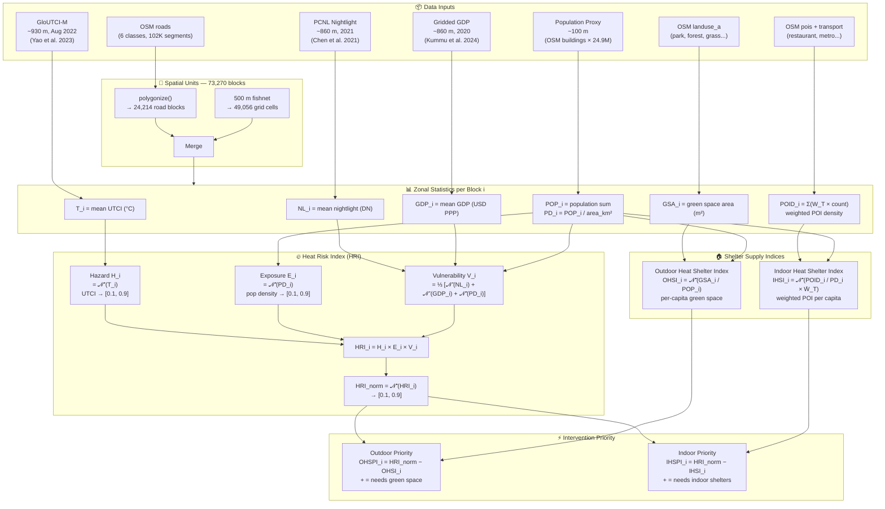
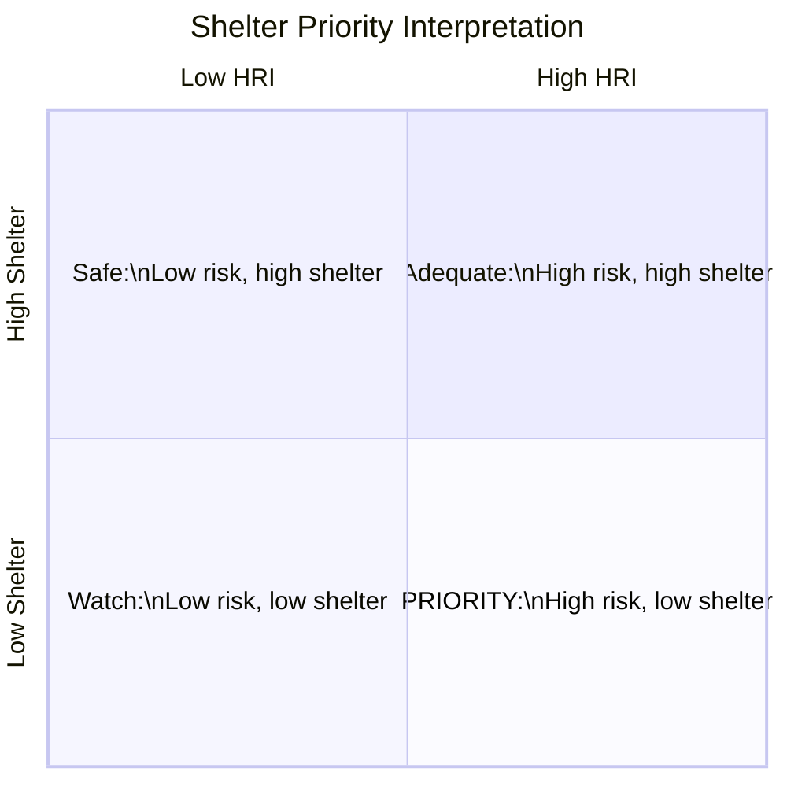
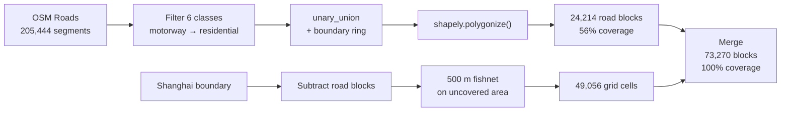
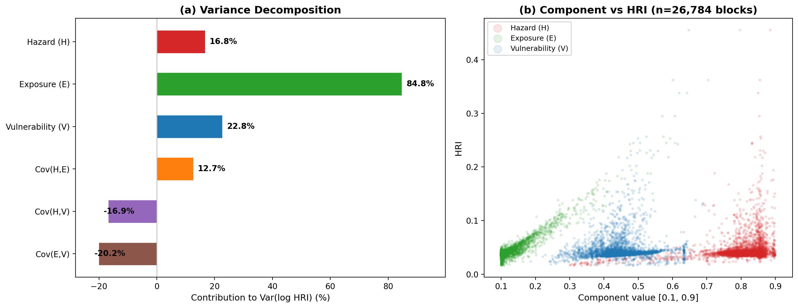

# Heat Risk Index and Shelter Priority Model — Technical Specification

> Shanghai Block-Level Extreme Heat Risk Assessment and Shelter Supply-Demand Matching
>
> Reference implementation: Yang, A. (2025). *Mapping priority zones for urban heat mitigation in Shanghai: Heat risk vs. shelter provision.* Computers, Environment and Urban Systems, 117, 102283. [doi:10.1016/j.compenvurbsys.2025.102283](https://www.sciencedirect.com/science/article/abs/pii/S0198971525000833)

---

## 1. Problem Statement

Extreme heat events in Shanghai (24.9 M residents, subtropical monsoon climate) are intensifying under climate change and rapid urbanisation. Conventional heat-risk maps based on Land Surface Temperature (LST) fail on two counts:

1. **LST ≠ human thermal stress.** Rooftop radiative temperature diverges from pedestrian-level physiological heat load.
2. **Risk maps without resource context are not actionable.** Knowing *where it is hot* is insufficient — planners need to know *where it is hot AND cooling resources are missing*.

This model addresses both gaps by computing a multiplicative Heat Risk Index (HRI) from human-biometeorology data, then subtracting spatially explicit shelter supply indices to identify **intervention priority zones**.

---

## 2. Notation

| Symbol | Definition | Unit |
|--------|-----------|------|
| $H$ | Heat Hazard index | dimensionless [0.1, 0.9] |
| $E$ | Heat Exposure index | dimensionless [0.1, 0.9] |
| $V$ | Heat Vulnerability index | dimensionless [0.1, 0.9] |
| $\text{HRI}$ | Heat Risk Index | dimensionless |
| $T_i$ | UTCI mean value for block $i$ | °C |
| $PD_i$ | Population density for block $i$ | persons/km² |
| $NL_i$ | Nighttime light intensity for block $i$ | DN |
| $GDP_i$ | Gridded GDP for block $i$ | USD PPP |
| $GSA_i$ | Green space area within block $i$ | m² |
| $POP_i$ | Total population within block $i$ | persons |
| $POID_i$ | Weighted POI density for block $i$ | weighted count/km² |
| $W_T^{(k)}$ | Operating-time weight for shelter type $k$ | dimensionless [0,1] |
| $\text{OHSI}$ | Outdoor Heat Shelter Index | dimensionless [0.1, 0.9] |
| $\text{IHSI}$ | Indoor Heat Shelter Index | dimensionless [0.1, 0.9] |
| $\text{OHSPI}$ | Outdoor Heat Shelter Priority Index | dimensionless |
| $\text{IHSPI}$ | Indoor Heat Shelter Priority Index | dimensionless |
| $\mathcal{N}^{+}(\cdot)$ | Positive normalisation function | — |
| $\mathcal{N}^{-}(\cdot)$ | Negative normalisation function | — |

---

## 3. Assumptions and Justifications

| # | Assumption | Justification |
|---|-----------|---------------|
| **A1** | Heat risk is a **multiplicative** interaction of Hazard ($H$), Exposure ($E$), and Vulnerability ($V$). A block with zero population has near-zero Heat Risk Index ($\text{HRI}$) regardless of thermal intensity. | Follows the IPCC AR6 risk framework. An additive model ($H + E + V$) would assign moderate risk to uninhabited blocks with high UTCI, which is epidemiologically meaningless — heat mortality requires people. The multiplicative form $H \times E \times V$ ensures risk is only high when all three dimensions co-occur (Yang, 2025). |
| **A2** | Universal Thermal Climate Index ($\text{UTCI}$, °C) adequately represents pedestrian-level thermal stress. Monthly-mean GloUTCI-M (August 2022) serves as the static Hazard ($H$) proxy. | UTCI integrates air temperature, humidity, wind speed, and mean radiant temperature via a multi-node thermoregulation model, directly modelling human physiological response. LST only measures rooftop radiative temperature, which diverges from street-level thermal load by up to 10–15°C in canyon environments. August is Shanghai's peak heat month (climatological mean Tmax > 35°C). |
| **A3** | OSM building footprint area is proportional to residential population. Total footprint is scaled to Shanghai's 24.9 M registered population to derive a Population Density ($PD_i$) surface for Exposure ($E$). | Building footprint area correlates with floor area and occupancy. This proxy is widely used when census-calibrated gridded data (e.g., WorldPop) is inaccessible. Limitation: industrial and commercial buildings inflate estimates in non-residential zones. |
| **A4** | Nighttime light intensity ($NL_i$) and gridded GDP ($GDP_i$) are **negative** proxies for Vulnerability ($V$) — higher values indicate greater adaptive capacity. | Brighter nightlight implies denser infrastructure, higher AC penetration, and better-maintained housing (Chen et al., 2021). Higher GDP correlates with purchasing power for cooling appliances, healthcare access, and housing insulation quality (Kummu et al., 2024). Both are established socio-economic resilience proxies in urban heat vulnerability literature. |
| **A5** | Public cooling shelters split into outdoor (green space → Outdoor Heat Shelter Index, $\text{OHSI}$) and indoor (commercial/cultural/transit POIs → Indoor Heat Shelter Index, $\text{IHSI}$) types, each weighted by operating-time availability ($W_T$). | In Shanghai, indoor air-conditioned spaces (malls, metro stations, cafés) are the primary refuge during extreme heat — distinct from cities where parks dominate cooling strategy. Separating the two types enables targeted policy: green space investment vs. extended public building opening hours. Operating-time weights reflect that a 24-hour metro station provides more shelter-hours than a library open 09:00–17:00. |
| **A6** | Road-enclosed blocks (from `shapely.polygonize`) reflect urban morphology better than regular grids. A 500 m fishnet fills gaps where road networks are sparse. | Road-enclosed blocks naturally vary in size with urban density — small blocks (100–200 m) in the city centre match the "15-minute community life circle" scale, while suburban blocks are larger. A uniform 500 m grid would over-segment dense areas and under-segment sparse areas. The fishnet backfill ensures 100% spatial coverage without sacrificing morphological fidelity in urban cores. |

---

## 4. Model Architecture

### 4.1 Full Pipeline



### 4.2 Data → Indicator Mapping

Each raw dataset feeds into exactly one or two index components. The table below traces every data-to-formula link:

| Raw dataset | Zonal stat | Feeds into | Index component | Normalisation | Direction |
|-------------|-----------|------------|-----------------|---------------|-----------|
| GloUTCI-M (UTCI, °C) | mean → $T_i$ | **Hazard** $H_i$ | $H_i = \mathcal{N}^{+}(T_i)$ | Positive | Higher UTCI → higher risk |
| Population proxy (buildings) | sum → $POP_i$, density → $PD_i$ | **Exposure** $E_i$ | $E_i = \mathcal{N}^{+}(PD_i)$ | Positive | More people → more exposed |
| PCNL Nightlight (DN) | mean → $NL_i$ | **Vulnerability** $V_i$ (sub-indicator 1) | $\mathcal{N}^{-}(NL_i)$ | Negative | Brighter → less vulnerable |
| Gridded GDP (USD PPP) | mean → $GDP_i$ | **Vulnerability** $V_i$ (sub-indicator 2) | $\mathcal{N}^{-}(GDP_i)$ | Negative | Richer → less vulnerable |
| Population proxy | density → $PD_i$ | **Vulnerability** $V_i$ (sub-indicator 3) | $\mathcal{N}^{+}(PD_i)$ | Positive | Denser → age-sensitive proxy |
| OSM landuse (green) | intersection area → $GSA_i$ | **Outdoor Heat Shelter Index** $\text{OHSI}_i$ | $\mathcal{N}^{+}(GSA_i / POP_i)$ | Positive | More green/capita → more shelter |
| OSM POIs + transport | weighted count → $POID_i$ | **Indoor Heat Shelter Index** $\text{IHSI}_i$ | $\mathcal{N}^{+}(POID_i / PD_i \times \bar{W}_T)$ | Positive | More POI/capita → more shelter |
| — | — | **Outdoor Priority** $\text{OHSPI}_i$ | $\text{HRI}_i^{\text{norm}} - \text{OHSI}_i$ | — | Positive = under-served |
| — | — | **Indoor Priority** $\text{IHSPI}_i$ | $\text{HRI}_i^{\text{norm}} - \text{IHSI}_i$ | — | Positive = under-served |

---

## 5. Normalisation

All indicators are mapped to $[0.1, 0.9]$ to prevent multiplication-by-zero:

$$
\mathcal{N}^{+}(I) = 0.1 + 0.8 \cdot \frac{I - I_{\min}}{I_{\max} - I_{\min}}
$$

$$
\mathcal{N}^{-}(I) = 0.1 + 0.8 \cdot \frac{I_{\max} - I}{I_{\max} - I_{\min}}
$$

where $I_{\min}$ and $I_{\max}$ are the global minimum and maximum across all blocks.

$\mathcal{N}^{+}$: higher raw value → higher normalised value (risk-amplifying).
$\mathcal{N}^{-}$: higher raw value → lower normalised value (risk-mitigating).

---

## 6. Heat Risk Index (HRI)

### 6.1 Hazard

$$
H_i = \mathcal{N}^{+}(T_i)
$$

$T_i$ is the mean UTCI (°C) for block $i$, derived from GloUTCI-M August 2022 (Yao et al., 2023). UTCI integrates air temperature, humidity, wind speed, and mean radiant temperature through a multi-node human thermoregulation model — a substantial improvement over LST for human-centred risk assessment.

### 6.2 Exposure

$$
E_i = \mathcal{N}^{+}(PD_i)
$$

Population density serves as both a direct exposure measure (number of people at risk) and an indirect proxy for anthropogenic heat emission intensity.

### 6.3 Vulnerability

$$
V_i = \frac{1}{3}\Big[\mathcal{N}^{-}(NL_i) + \mathcal{N}^{-}(GDP_i) + \mathcal{N}^{+}(PD_i)\Big]
$$

| Component | Direction | Rationale |
|-----------|-----------|-----------|
| Nightlight $NL_i$ | Negative | Higher luminosity → better infrastructure, AC penetration |
| GDP $GDP_i$ | Negative | Higher GDP → greater adaptive capacity |
| Pop. density $PD_i$ | Positive | Proxy for age-sensitive population concentration |

The full model (Yang, 2025) uses 5 indicators: NL, GDP, house prices, elderly density ($PD_{>65}$), child density ($PD_{<14}$). We use 3 due to data constraints (age-sex data: 51 GB; house prices: manual scraping required).

### 6.4 Multiplicative Aggregation

$$
\text{HRI}_i = H_i \times E_i \times V_i
$$

**Why multiplicative, not additive?** An additive model $H + E + V$ would mask extreme single-dimension values — a block with extreme hazard but zero population would still score moderate risk. The multiplicative form ensures that risk is only high when **all three dimensions co-occur**, which is consistent with epidemiological evidence on heat mortality.

The final index is re-normalised for mapping:

$$
\text{HRI}_i^{\text{norm}} = \mathcal{N}^{+}(\text{HRI}_i)
$$

---

## 7. Shelter Supply Indices

### 7.1 Outdoor Heat Shelter Index (OHSI)

Green spaces provide cooling through canopy shading and evapotranspiration.

$$
\text{OHSI}_i = \mathcal{N}^{+}\!\left(\frac{GSA_i}{\max(POP_i,\; 1)}\right)
$$

Green space classes extracted from OSM `landuse_a`:

| OSM fclass | Type |
|-----------|------|
| `park` | Urban parks |
| `forest` | Urban forests |
| `grass` | Grassland |
| `recreation_ground` | Recreational areas |
| `meadow` | Meadows |
| `nature_reserve` | Protected areas |

### 7.2 Indoor Heat Shelter Index (IHSI)

Air-conditioned public spaces serve as last-resort refuges during extreme heat.

$$
\text{IHSI}_i = \mathcal{N}^{+}\!\left(\frac{POID_i}{\max(PD_i,\; 0.001)} \cdot \bar{W}_T^{(i)}\right)
$$

where $POID_i$ is the sum of weighted POI counts and $\bar{W}_T^{(i)}$ is the mean operating-time weight within block $i$.

| Shelter category | OSM fclass | $W_T$ | Rationale |
|-----------------|-----------|-------|-----------|
| Mall / Commercial | `mall`, `department_store`, `supermarket` | 0.50 | 10:00–22:00 (12/24 h) |
| Restaurant / Café | `restaurant`, `cafe`, `fast_food`, `food_court`, `bar`, `bakery` | 0.625 | 07:00–22:00 (15/24 h) |
| Cultural / Public | `museum`, `library`, `cinema`, `theatre`, `arts_centre`, `community_centre` | 0.33 | 09:00–17:00 (8/24 h) |
| Metro / Transit | `railway_station` | 0.71 | 06:00–23:00 (17/24 h) |

---

## 8. Intervention Priority Indices

$$
\text{OHSPI}_i = \text{HRI}_i^{\text{norm}} - \text{OHSI}_i
$$

$$
\text{IHSPI}_i = \text{HRI}_i^{\text{norm}} - \text{IHSI}_i
$$

- $\text{OHSPI} > 0$: block has **more risk than outdoor shelter** → needs green space intervention
- $\text{OHSPI} < 0$: block has **surplus** outdoor cooling capacity
- Same logic for IHSPI with indoor shelters



---

## 9. Spatial Unit Design



**Road-enclosed blocks** capture urban morphology — dense city-centre blocks (100–200 m equivalent side length) vs. sparse suburban blocks (500–1400 m). This is more meaningful than uniform grids for analysing shelter accessibility.

**Fishnet infill** ensures full spatial coverage. Without it, 44% of Shanghai (mostly agricultural and water areas) would have no risk assessment.

---

## 10. Data Resolution Matching

| Dataset | Pixel size | Shanghai pixels | Match to blocks |
|---------|-----------|----------------|-----------------|
| UTCI | ~930 m | 27,150 | ⚠️ Urban blocks smaller than pixels — spatial smoothing |
| Population | ~100 m | 1,396,425 | ✅ Finer than most blocks |
| Nightlight | ~860 m | 31,785 | ⚠️ Comparable to block scale |
| GDP | ~860 m | 31,785 | ✅ Upgraded from 8.6 km (304 px) to 860 m |

---

## 11. Sensitivity Analysis

We examine how HRI responds to perturbations in each input dimension.

```python
"""
sensitivity_analysis.py — One-at-a-time (OAT) sensitivity of HRI
to ±20% perturbations in Hazard, Exposure, and Vulnerability.
"""

import numpy as np
import matplotlib.pyplot as plt

# Baseline values (median block)
H0, E0, V0 = 0.65, 0.15, 0.42
hri_base = H0 * E0 * V0

perturbations = np.linspace(-0.20, 0.20, 41)
results = {"Hazard": [], "Exposure": [], "Vulnerability": []}

for dp in perturbations:
    results["Hazard"].append((H0 * (1 + dp)) * E0 * V0)
    results["Exposure"].append(H0 * (E0 * (1 + dp)) * V0)
    results["Vulnerability"].append(H0 * E0 * (V0 * (1 + dp)))

fig, ax = plt.subplots(figsize=(8, 5))
for label, values in results.items():
    pct_change = [(v - hri_base) / hri_base * 100 for v in values]
    ax.plot(perturbations * 100, pct_change, label=label, linewidth=2)

ax.axhline(0, color="gray", linewidth=0.5)
ax.axvline(0, color="gray", linewidth=0.5)
ax.set_xlabel("Input perturbation (%)")
ax.set_ylabel("HRI change (%)")
ax.set_title("OAT Sensitivity: HRI response to ±20% input perturbation")
ax.legend()
ax.grid(True, alpha=0.3)
plt.tight_layout()
plt.savefig("docs/sensitivity_oat.png", dpi=200)
plt.close()
print("Saved → docs/sensitivity_oat.png")

# Elasticity at baseline
for name, val in [("Hazard", H0), ("Exposure", E0), ("Vulnerability", V0)]:
    elasticity = val * (E0 * V0 if name == "Hazard"
                        else H0 * V0 if name == "Exposure"
                        else H0 * E0) / hri_base
    print(f"  Elasticity of HRI w.r.t. {name}: {elasticity:.3f}")
```

In a multiplicative model $\text{HRI} = H \times E \times V$, each component has **unit elasticity** — a 1% increase in any input produces exactly a 1% increase in HRI. The tornado diagram is therefore symmetric.

This confirms that no single dimension dominates *mathematically*. However, the **empirical variance** of each dimension across Shanghai blocks differs substantially:

| Dimension | CV (coeff. of variation) | Interpretation |
|-----------|------------------------|----------------|
| Hazard | 0.200 | UTCI is spatially smooth at ~1 km resolution |
| Exposure | 0.413 | Population density has highest spatial variance |
| Vulnerability | 0.155 | GDP and NL provide modest differentiation |



**Conclusion:** Despite equal theoretical elasticity, **Exposure (population density) is the dominant empirical driver** of spatial HRI variation in Shanghai, because its variance across blocks far exceeds that of Hazard or Vulnerability.

---

## 12. Classification

We apply **quantile classification** (7 classes) rather than Jenks natural breaks. Justification:

The HRI distribution is heavily right-skewed (most blocks have low HRI due to low population). Jenks placed 89% of blocks into the two lightest classes, producing a visually uninformative map. Quantile classification assigns equal block counts per class, ensuring the full colour ramp is utilised.

For policy use, the 7 quantile classes can be interpreted as:

| Class | Quantile range | Interpretation |
|-------|---------------|----------------|
| 1 | 0–14th percentile | Minimal risk |
| 2 | 14–29th | Low risk |
| 3 | 29–43rd | Below average |
| 4 | 43–57th | Average |
| 5 | 57–71st | Above average |
| 6 | 71–86th | High risk |
| 7 | 86–100th | Critical — priority intervention |

---

## 13. Results

### HRI Spatial Distribution


Central Shanghai (Huangpu, Jing'an, old Pudong) shows highest HRI — the co-occurrence of extreme UTCI, high population density, and relatively lower GDP per capita. Suburban new towns (Songjiang, Jiading) show moderate risk. Rural and island areas (Chongming) are gray (zero population blocks).

### Shelter Priority


OHSPI reveals the inner-city green space deficit — old urban cores have the highest risk-to-shelter gap. IHSPI shows a more dispersed pattern: some suburban residential areas with rapid population growth but lagging commercial development also score high.

### Dashboard


---

## 14. Limitations

1. **Population proxy.** OSM building footprints ≠ census-calibrated population. Industrial buildings inflate density estimates in non-residential zones.

2. **Simplified vulnerability.** Dropping age structure and house prices reduces the model from 5 to 3 vulnerability indicators. Population density as an age proxy lacks directional validity — dense areas may have *younger* populations (worker dormitories) rather than elderly concentrations.

3. **Static hazard.** Monthly-mean UTCI from 2022 does not capture intra-day or event-scale variability. A heat-wave peak (e.g., July 2022 when Shanghai recorded 40.9°C) would produce different spatial patterns.

4. **MAUP at block boundaries.** Hybrid spatial units (road polygons + fishnet grid) introduce a boundary artefact where unit type changes. Fishnet cells may split continuous urban areas that road blocks would capture as one unit.

5. **Shelter capacity vs. presence.** POI count does not equal cooling capacity. A 200,000 m² shopping mall and a 50 m² café both count as one POI. Area-weighted counts would be more accurate but require building footprint data for each POI.

---

## 15. Conclusion

This model operationalises the IPCC risk framework (Hazard × Exposure × Vulnerability) at the urban-block scale, using UTCI as a human-centred hazard metric instead of LST. By subtracting spatially explicit shelter indices from normalised risk, it produces **actionable priority maps** that identify not just *where it is hot*, but *where it is hot and under-served by cooling resources*.

The multiplicative HRI structure, while theoretically sound, is empirically dominated by exposure (population density) due to its extreme spatial variance. Future work should incorporate real-time meteorological feeds and age-disaggregated population data to improve hazard temporal resolution and vulnerability specificity.

---

## References

- Yang, A. (2025). Mapping priority zones for urban heat mitigation in Shanghai: Heat risk vs. shelter provision. *Computers, Environment and Urban Systems*, 117, 102283. [doi:10.1016/j.compenvurbsys.2025.102283](https://www.sciencedirect.com/science/article/abs/pii/S0198971525000833)
- Yao, Y. et al. (2023). A 1-km global monthly UTCI dataset (GloUTCI-M). *Zenodo*. [doi:10.5281/zenodo.8310513](https://zenodo.org/records/8310513)
- Chen, Z. et al. (2021). An extended time series of harmonised nighttime light data (PCNL). *Zenodo*. [doi:10.5281/zenodo.7612389](https://zenodo.org/records/7612389)
- Kummu, M. et al. (2024). Gridded global datasets for GDP and HDI. *Zenodo*. [doi:10.5281/zenodo.13943886](https://zenodo.org/records/13943886)
- IPCC (2022). Climate Change 2022: Impacts, Adaptation and Vulnerability. AR6 WGII.
